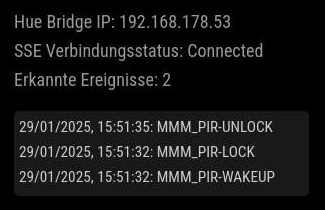

# MMM-HueControl

A MagicMirror² module to control other MagicMirror modules using Philips Hue v2 API.



This module allows you to control other MagicMirror modules using your Philips Hue devices. It listens for events from your Hue Bridge and broadcasts notifications to other modules based on Server-Sent-Events (SSE).

For more information about SSE using the Philips Hue v2 API please visit https://developers.meethue.com/develop/hue-api-v2/core-concepts/#events

## Installation

### Install

In your terminal, go to your MagicMirror² Module folder, clone MMM-HueControl, and install its dependencies:

```bash
cd ~/MagicMirror/modules
git clone https://github.com/DreamyChloe/MMM-HueControl.git
cd MMM-HueControl
npm install
```

### Update

To update the module, navigate to the module's folder, pull the latest changes, and reinstall dependencies:

```bash
cd ~/MagicMirror/modules/MMM-HueControl
git pull
npm install
```

## Using the module

To use this module, add it to the modules array in the `config/config.js` file:

```js
{
    module: "MMM-HueControl",
    config: {
        hueBridgeIpAddress: "your-hue-bridge-ip-address",
        hueApplicationKey: "your-hue-application-key",
        events: [
            {
                eventId: "15656231-01e7-4ab4-a3f7-d032d677f991",
                eventType: "light",
                eventContent: {
                    on: {
                        on: true
                    }
                },
                notification: ["MMM_PIR-WAKEUP", "MMM_PIR-LOCK"]
            },
            {
                eventId: "15656231-01e7-4ab4-a3f7-d032d677f991",
                eventType: "light",
                eventContent: {
                    on: {
                        on: false
                    }
                },
                notification: ["MMM_PIR-UNLOCK"]
            },
        ]
    }
},
```

Note: This module doesn't need a specific position as it doesn't display anything on the mirror by default.

## Configuration options

| Option | Required | Description                                                                                              |
|--------|----------|----------------------------------------------------------------------------------------------------------|
| `hueBridgeIpAddress` | Yes      | The IP address of your Philips Hue Bridge                                                                |
| `hueApplicationKey` | Yes      | Your Hue application key (see Philips Hue documentation on how to obtain this)                           |
| `events` | No       | An array of event objects to listen for                                                                  |
| `reconnectTimeout` | No       | Time in milliseconds to wait before attempting to reconnect (default: 60sec)                             |
| `debug` | No       | Set to `true` to enable debug mode, which displays additional information on the mirror (default: false) |

### Event Object Structure

Each event object in the `events` array should have the following structure:

| Property | Description                                                          |
|----------|----------------------------------------------------------------------|
| `eventId` | The ID of the Hue device or event to monitor                         |
| `eventType` | The type of event (e.g., "button", "light", or any other type defined by the Hue API) |
| `eventContent` | The specific state change to listen for                              |
| `notification` | The notification to send when the event occurs                       |

## Notifications

This module sends custom notifications based on the events you configure. These notifications can be used by other modules to trigger actions.

### Example: Controlling MMM-Pir module

You can use this module to control the MMM-Pir module based on the state of your Hue lights. Here's an example of how to configure MMM-HueControl to work with MMM-Pir:

```js
{
    module: "MMM-HueControl",
    config: {
        hueBridgeIpAddress: "your-hue-bridge-ip-address",
        hueApplicationKey: "your-hue-application-key",
        events: [
            {
                eventId: "15656231-01e7-4ab4-a3f7-d032d677f991",
                eventType: "light",
                eventContent: {
                    on: {
                        on: true
                    }
                },
                notification: ["MMM_PIR-WAKEUP", "MMM_PIR-LOCK"]
            },
            {
                eventId: "15656231-01e7-4ab4-a3f7-d032d677f991",
                eventType: "light",
                eventContent: {
                    on: {
                        on: false
                    }
                },
                notification: ["MMM_PIR-UNLOCK"]
            },
        ]
    }
}
```

Now, when the specified Hue light (with ID "15656231-01e7-4ab4-a3f7-d032d677f991") is turned on, MMM-HueControl will broadcast "MMM_PIR-WAKEUP" and "MMM_PIR-LOCK. When the light is turned off, it will send the "MMM_PIR-UNLOCK" notification, allowing the display to turn off based on the MMM-Pir module's settings.

In theory this also allows you to use a Hue Motion Sensor instead of a PIR-Sensor to turn off the screen. 

### Example: Using Hue Button to control modules

You can also use Hue buttons to control other MagicMirror modules. Here's an example of how to configure MMM-HueControl to work with a Hue button:

Given following broadcasted SSE event:
```json
[
    {
        "creationtime": "2025-01-29T15:02:27Z",
        "data": [
            {
                "button": {
                    "button_report": {
                        "event": "initial_press",
                        "updated": "2025-01-29T15:02:26.991Z"
                    },
                    "last_event": "initial_press"
                },
                "id": "459cabd7-7ff0-424f-b179-604e7cc6146d",
                "id_v1": "/sensors/13",
                "owner": {
                    "rid": "d2fe3dbc-3add-4a34-ba93-76e2d0fb11de",
                    "rtype": "device"
                },
                "type": "button"
            }
        ],
        "id": "d019ec28-3f82-4dca-a40e-956508b05341",
        "type": "update"
    }
]
```

```js
{
    module: "MMM-HueControl",
    config: {
        hueBridgeIpAddress: "your-hue-bridge-ip-address",
        hueApplicationKey: "your-hue-application-key",
        events: [
            {
                eventId: "459cabd7-7ff0-424f-b179-604e7cc6146d",
                eventType: "button",
                eventContent: {
                    button: {
                        button_report: {
                            event: "initial_press"
                        }
                    }
                },
                notification: "BUTTON_PRESSED"
            }
        ]
    }
}
```

In this configuration, when the Hue button (with ID "459cabd7-7ff0-424f-b179-604e7cc6146d") is pressed, MMM-HueControl will broadcast a "BUTTON_PRESSED" notification. Other modules can listen for this notification to perform actions.

For example, you could use this to toggle the visibility of a module.

## Contributing

If you find any bugs or have suggestions for improvements, please open an issue on the [GitHub repository](https://github.com/DreamyChloe/MMM-HueControl).

## License

This project is licensed under the MIT License. See the [LICENSE](LICENSE) file for details.

[mm]: https://github.com/MagicMirrorOrg/MagicMirror
